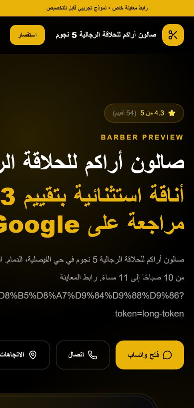
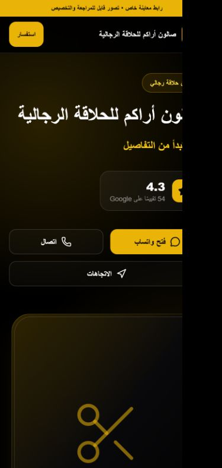

# مراجعة المعاينة ورسالة التواصل

## قبل وبعد على الجوال

| قبل | بعد |
| --- | --- |
|  |  |

تم التقاط الصورتين على بيانات Mock نفسها عند عرض جوال 390px، دون استخدام مفاتيح أو بيانات إنتاج.

## مثال الرسالة

### قبل

```text
السلام عليكم، أنا محمد. جهزت نموذج معاينة بسيط لـ صالون أراكم للحلاقة الرجالية 5 نجوم اعتمادًا على المعلومات العامة في خرائط Google:
https://DOMAIN/preview/%D8%B5%D8%A7%D9%84%D9%88%D9%86-%D8%A3%D8%B1%D8%A7%D9%83%D9%85?token=LONG_TOKEN
```

### بعد

```text
السلام عليكم، معك محمد.
جهزت لكم تصورًا سريعًا لموقع يعرّف بخدمات صالون أراكم للحلاقة الرجالية ويسهّل وصول العملاء لكم من الجوال. التصور يرتب معلومات النشاط والخدمات ووسائل التواصل في صفحة واضحة وسريعة.

رابط المعاينة:
https://DOMAIN/p/YS9B22YmYu4

إذا ناسبكم التصور أرسل لكم التفاصيل، وإن ما كان مناسب ما راح أكرر التواصل. يعطيكم العافية.
```

## الرابط

```text
قبل: https://DOMAIN/preview/%D8%B5%D8%A7%D9%84%D9%88%D9%86...?token=LONG_TOKEN
بعد:  https://DOMAIN/p/YS9B22YmYu4
```

الكود القصير مشتق من UUID عشوائي مع HMAC، ويُخزن في Supabase كـ SHA-256 hash فقط. المسار القديم ما زال مدعومًا.

## Migration

```text
supabase/migrations/20260717132217_professional_preview_share_codes.sql
```

Migration إضافية فقط: تضيف `public_share_code_hash` وفهرسًا فريدًا مشروطًا، دون حذف أو تعديل بيانات حالية.
